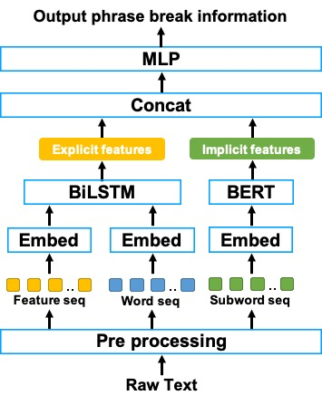

Submitted to INTERSPEECH2021

##### Authors
- Kosuke Futamata
- Byeongseon Park
- Ryuichi Yamamoto
- Kentaro Tachibana

 

##### Abstract
We propose a novel phrase break prediction method that combines implicit features extracted from a pre-trained large language model, a.k.a BERT, and explicit features extracted from BiLSTM with linguistic features.
In conventional BiLSTM-based methods, word representations and/or sentence representations are used as independent components.
The proposed method takes account of both representations to extract the latent semantics, which cannot be captured by previous methods.
The objective evaluation results show that the proposed method obtains an absolute improvement of 3.2 points for the F1 score compared with BiLSTM-based conventional methods using linguistic features.
Moreover, the perceptual listening test results verify that a TTS system that applied our proposed method achieved a mean opinion score of 4.39 in prosody naturalness, which is highly competitive with the score of 4.37 for synthesized speech with ground-truth phrase breaks.

 

##### Audio samples
There are 7 systems used for subjective evaluations.

- **Reference (Natural)** : Recorded speeches.
- **Reference (TTS)**: Synthesized speeches from the test set.
- **Rule-based**:  A rule-based method that inserts phrase breaks only after punctuations.
- **BiLSTM (Tokens)**: BiLSTM based method using only a source sequence [[1]](https://www.isca-speech.org/archive/Interspeech_2016/abstracts/0885.html).
- **BiLSTM (Features)**:  BiLSTM (Tokens) based method adding designed linguistic features [[2]](https://www.isca-speech.org/archive/Interspeech_2017/abstracts/0419.html).
- **BERT**: the method uses only BERT model.
- **BiLSTM (Features) + BERT**: The proposed method that combines BiLSTM (Features) and BERT.

FastSpeech2 based acoustic model[[3](https://arxiv.org/abs/2006.04558)] and Parallel WaveGAN vocoder[[4](https://arxiv.org/abs/1910.11480)] are used for speech generation.
 
 

Sample 1

| Reference (Natural) | Reference (TTS) | Rule-based |
|-------------------------|---------------------|----------------|
| <audio controls src="./samples/sample01/sample01.reference.natural.wav"></audio> | <audio controls src="./samples/sample01/sample01.reference.tts.wav"></audio> | <audio controls src="./samples/sample01/sample01.rule-based.wav"></audio> |

| BiLSTM (Tokens) | BiLSTM (Features) | BERT |
|-------------------------|---------------------|----------------|-----------------|
| <audio controls src="./samples/sample01/sample01.bilstm-tokens.wav"></audio> | <audio controls src="./samples/sample01/sample01.bilstm-features.wav"></audio> | <audio controls src="./samples/sample01/sample01.bert.wav"></audio> |

| BiLSTM (Features) + BERT |
|--------------------------|
| <audio controls src="./samples/sample01/sample01.bilstm-features-bert.wav"></audio> |

 

Sample 2

| Reference (Natural) | Reference (TTS) | Rule-based |
|-------------------------|---------------------|----------------|
| <audio controls src="./samples/sample02/sample02.reference.natural.wav"></audio> | <audio controls src="./samples/sample02/sample02.reference.tts.wav"></audio> | <audio controls src="./samples/sample02/sample02.rule-based.wav"></audio> |

| BiLSTM (Tokens) | BiLSTM (Features) | BERT |
|-------------------------|---------------------|----------------|-----------------|
| <audio controls src="./samples/sample02/sample02.bilstm-tokens.wav"></audio> | <audio controls src="./samples/sample02/sample02.bilstm-features.wav"></audio> | <audio controls src="./samples/sample02/sample02.bert.wav"></audio> |

| BiLSTM (Features) + BERT |
|--------------------------|
| <audio controls src="./samples/sample02/sample02.bilstm-features-bert.wav"></audio> |

 

Sample 3

| Reference (Natural) | Reference (TTS) | Rule-based |
|-------------------------|---------------------|----------------|
| <audio controls src="./samples/sample03/sample03.reference.natural.wav"></audio> | <audio controls src="./samples/sample03/sample03.reference.tts.wav"></audio> | <audio controls src="./samples/sample03/sample03.rule-based.wav"></audio> |

| BiLSTM (Tokens) | BiLSTM (Features) | BERT |
|-------------------------|---------------------|----------------|-----------------|
| <audio controls src="./samples/sample03/sample03.bilstm-tokens.wav"></audio> | <audio controls src="./samples/sample03/sample03.bilstm-features.wav"></audio> | <audio controls src="./samples/sample03/sample03.bert.wav"></audio> |

| BiLSTM (Features) + BERT |
|--------------------------|
| <audio controls src="./samples/sample03/sample03.bilstm-features-bert.wav"></audio> |

 

Sample 4

| Reference (Natural) | Reference (TTS) | Rule-based |
|-------------------------|---------------------|----------------|
| <audio controls src="./samples/sample04/sample04.reference.natural.wav"></audio> | <audio controls src="./samples/sample04/sample04.reference.tts.wav"></audio> | <audio controls src="./samples/sample04/sample04.rule-based.wav"></audio> |

| BiLSTM (Tokens) | BiLSTM (Features) | BERT |
|-------------------------|---------------------|----------------|-----------------|
| <audio controls src="./samples/sample04/sample04.bilstm-tokens.wav"></audio> | <audio controls src="./samples/sample04/sample04.bilstm-features.wav"></audio> | <audio controls src="./samples/sample04/sample04.bert.wav"></audio> |

| BiLSTM (Features) + BERT |
|--------------------------|
| <audio controls src="./samples/sample04/sample04.bilstm-features-bert.wav"></audio> |

 

Sample 5

| Reference (Natural) | Reference (TTS) | Rule-based |
|-------------------------|---------------------|----------------|
| <audio controls src="./samples/sample05/sample05.reference.natural.wav"></audio> | <audio controls src="./samples/sample05/sample05.reference.tts.wav"></audio> | <audio controls src="./samples/sample05/sample05.rule-based.wav"></audio> |

| BiLSTM (Tokens) | BiLSTM (Features) | BERT |
|-------------------------|---------------------|----------------|-----------------|
| <audio controls src="./samples/sample05/sample05.bilstm-tokens.wav"></audio> | <audio controls src="./samples/sample05/sample05.bilstm-features.wav"></audio> | <audio controls src="./samples/sample05/sample05.bert.wav"></audio> |

| BiLSTM (Features) + BERT |
|--------------------------|
| <audio controls src="./samples/sample05/sample05.bilstm-features-bert.wav"></audio> |

 

##### References
- \[1\]:  A. Vadapalli and S. V. Gangashetty, “An investigation of recurrent neural network architectures using word embeddings for phrase break prediction", in Proceedings of INTERSPEECH 2016 ([ISCA](https://www.isca-speech.org/archive/Interspeech_2016/abstracts/0885.html))
- \[2\]:  V. Klimkov, A. Nadolski, A. Moinet, B. Putrycz, R. BarraChicote, T. Merritt, and T. Drugman, “Phrase break prediction
for long-form reading tts: Exploiting text structure information", in Proceedings of INTERSPEECH 2017 ([ISCA](https://www.isca-speech.org/archive/Interspeech_2017/abstracts/0419.html))
- \[3\]: R. Yi, H. Chenxu, Q. Tao, Z. Sheng, Z. Zhou, and L. Tie-Yan, “FastSpeech 2: Fast and high-quality end-to-end text-to-speech,” in Proceedings of ICLR ([arXiv](https://arxiv.org/abs/2006.04558))
- \[4\]: R. Yamamoto, E. Song, and J.-M. Kim, “Parallel WaveGAN: A fast waveform generation model based on generative adversarial networks with multi-resolution spectrogram,” in Proc. ICASSP ([arXiv](https://arxiv.org/abs/1910.11480))
 

##### Acknowledgements
This work was supported by Clova Voice, NAVER Corp.,Seongnam, Korea.

##### Citation
